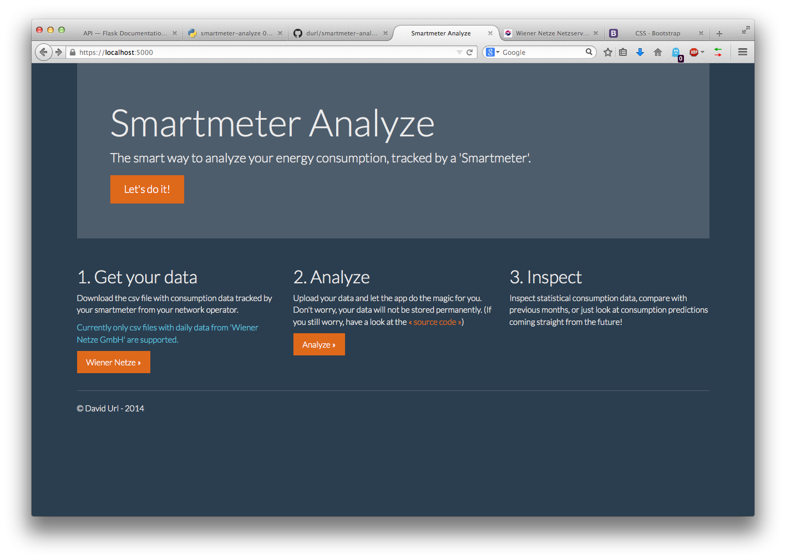
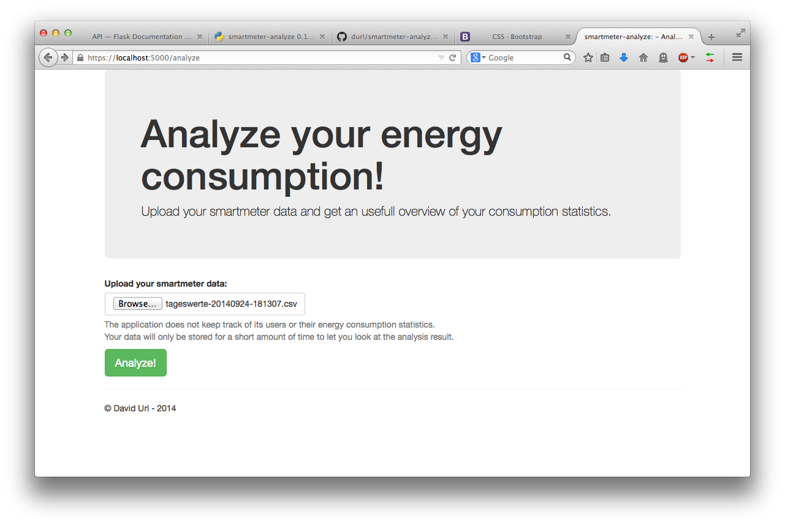

======
README
======

This Tool was written to analyze your personal energy consumption.

The Tool currently only supports CSV files with daily consumption values, as
provided by the 'Smart Metering' service of 'Wiener Netze GmbH'.

Features
========

* Generation of basic consumption summaries (averages, peaks, etc.)
* Basic consumption prediction
* Handling of one or many (not necessarily disjunct) datasets

Installation
============

::

    $ pip install smartmeter-analyze

You can also run the application as a Docker container::

    $ make run

This will build and run a container with the web interface of the application. In this case you can access the application over port 80 of the containers host.

Requirements
============

smartmeter-analyze uses the following libraries:

* pandas
* numpy

In order to use the web interface additional libraries are needed:

* flask
* docutils 

Usage
=====

Print a statistical summary of your energy consumption::

    $ smutil summary consumption-file.csv

Print the summary, using multiple files or directories::

    $ smutil summary ~/some_dir_with_consumption_files/ another-file.csv

You can download your energy consumption data from smartmetering.wienernetze.at

To start the web interface, run::

    $ smutil run_webutil

or for the container version::

    $ make run

The interface is accessible with this URL::

    http://localhost:5000/analyze

If you run the application in the Docker container you can use port 80 on the containers host.
To stop and remove the container use::
    
    $ make clean

Screenshots
===========

TODO
====

* More sophisticated summaries
* import/storage of data
* Report generation
* integration of pricing (energy only)

Credits
=======

Icon
----

The Icon was composed by the following pictograms:

* Graph designed by Pham Thi Dieu Linh from the thenounproject.com
* Socket designed by hunotika from the thenounproject.com

Themes/Stylesheets
------------------

* Bootstrap from http://getbootstrap.com
* Bootstrap Themes from http://bootswatch.com/
